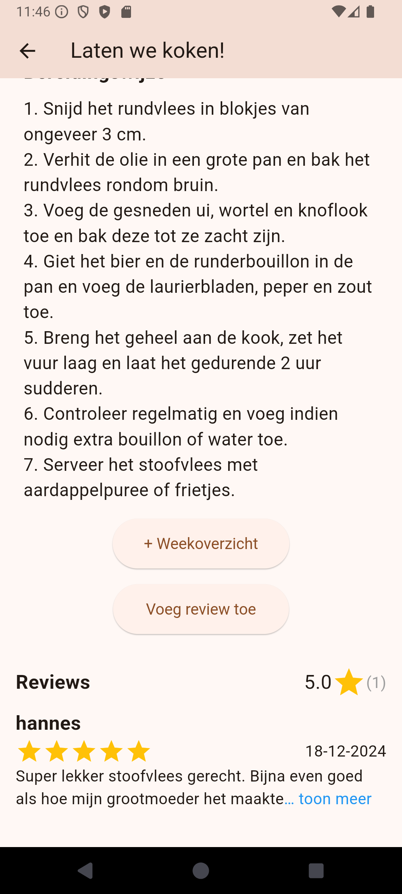

# Culinary Code
This is a recipe app developed with the purpose of simplifying the process of looking for new things to try out. Additionally this app has a smart-grocerylist function built in that will compile the ingredients for planned meals into one list with an option to add or remove items. The images below give a quick overview of other functionality.

  
  
  
  
  
  
  
  
  

## Repository Overview

### 1. **Algemeen**
- **Description**: Organization-wide wiki and documentation repository.
- **Purpose**: Contains general information, guides, and policies applicable across all repositories.
- **Key Contents**:
  - Coding standards
  - Deployment guidelines
  - Organizational policies
  - Shared resources (e.g., logos, templates, etc.)

### 2. **Frontend**
- **Description**: Mobile application frontend repository.
- **Tech Stack**: Flutter
- **Key Features**:
  - User interface development
  - Mobile app components
  - Integration with backend APIs

### 3. **Backend**
- **Description**: Backend services repository.
- **Tech Stack**: .NET
- **Key Features**:
  - API development
  - Business logic implementation
  - Data storage and retrieval

### 4. **Infrastructure as Code (IaC)**
- **Description**: Infrastructure automation and management repository.
- **Tech Stack**: Docker, Bash
- **Key Features**:
  - Docker images
  - Docker Compose files
  - Deployment scripts and configurations

## Getting Started

Refer to the setup instructions in each repository for more details.
Consult the wiki for a detailed instruction guide.

## Contributing

We welcome contributions! Please follow these guidelines:
- Read the [contribution guidelines](https://github.com/culinary-code/Algemeen/wiki/Contribution-Guidelines).
- Follow coding standards and commit message conventions.
- Submit pull requests with clear descriptions and adhere to the review process.
